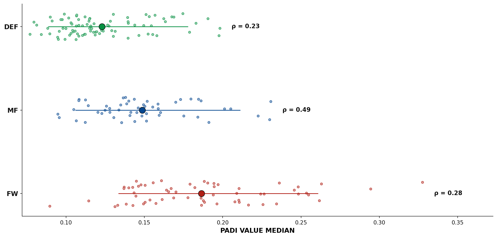

# PADI — Phase-Adjusted Decision Index

**Author:** Gabriel Carbinatto (gabrielcarbinatto@usp.br)

---

## Introduction

Traditional passing metrics in football often ignore the tactical priorities that vary across different phases of play. A progressive build-up pass and a conservative retention pass during transition may be evaluated identically, despite serving fundamentally different tactical objectives.

This research introduces **PADI (Phase-Adjusted Decision Index)**, a metric designed to evaluate passing decision quality within the context of game phases. Unlike phase-agnostic approaches, PADI is grounded in observed player behavior, addressing whether phase-aware evaluation provides more meaningful insights into playmaking quality.

---

## Methods

The analysis uses data from 10 A-League matches, covering 8,585 passes. Two SkillCorner data sources are integrated: **Dynamic Events**, containing player possession events and passing options with xThreat and xPass values, and **Phases of Play**, which label temporal intervals as build_up, create, finish, chaotic, transition, direct, set_play, or quick_break.

For each pass, PADI compares the chosen option against all available alternatives. Threat and safety scores are computed from the rank of the chosen option in xThreat and xPass, respectively, normalized to the [0,1] interval. These scores are combined using phase-specific weights balancing offensive progression and ball retention.

Phase weights are estimated via logistic regression on actual player choices. For each phase, the model predicts option selection using normalized threat and safety scores, controlling for defensive pressure and contextual risk. Coefficients associated with threat and safety are normalized to obtain phase-specific weights reflecting observed tactical behavior.

Player performance is aggregated using the median PADI value for players with at least 45 minutes played and a minimum of five passes. Validation is performed using manually collected SofaScore ratings, with Pearson correlation computed across 202 player–match observations.

---

## Results

The logistic regression reveals distinct tactical priorities across phases (Table 1). Build-up phases emphasize progression (w_T = 0.89), while transition phases prioritize ball retention (w_P = 0.97). Other phases exhibit intermediate trade-offs between threat and safety.

**Table 1 — Phase-specific weights estimated via logistic regression**

| Phase        | w_T (Threat) | w_P (Safety) |
|-------------|---------------|---------------|
| build_up    | 0.888         | 0.112         |
| set_play    | 0.850         | 0.150         |
| quick_break | 0.846         | 0.154         |
| finish      | 0.610         | 0.390         |
| chaotic     | 0.330         | 0.670         |
| direct      | 0.246         | 0.754         |
| create      | 0.058         | 0.942         |
| transition  | 0.034         | 0.966         |

After collecting SofaScore evaluations and computing the median PADI value per player per match, based on all passes executed, the overall validation reveals a positive and statistically significant correlation between PADI and SofaScore ratings (r = 0.24, p < 0.001). Position-specific analysis highlights the expected heterogeneity: midfielders exhibit the strongest correlation (r = 0.49), while forwards (r = 0.28) and defenders (r = 0.23) show weaker associations. These patterns are illustrated in Figure 1.

**Figure 1 — PADI distribution and correlation with SofaScore ratings by position**

---

## Conclusion

This study demonstrates that passing decision quality, as measured by PADI, is meaningfully related to SofaScore player ratings while capturing a distinct component of performance. The weak but statistically significant overall correlation indicates that PADI explains a specific aspect of player quality rather than general performance. Position-specific results support this interpretation: PADI aligns most strongly with midfielder ratings, where passing decisions are central, and shows appropriately weaker associations for forwards and defenders, whose ratings are largely driven by goals, assists, and defensive actions beyond PADI’s scope. These findings provide evidence of construct validity and position PADI as a complementary tool for isolating decision-making quality within a broader performance assessment framework.